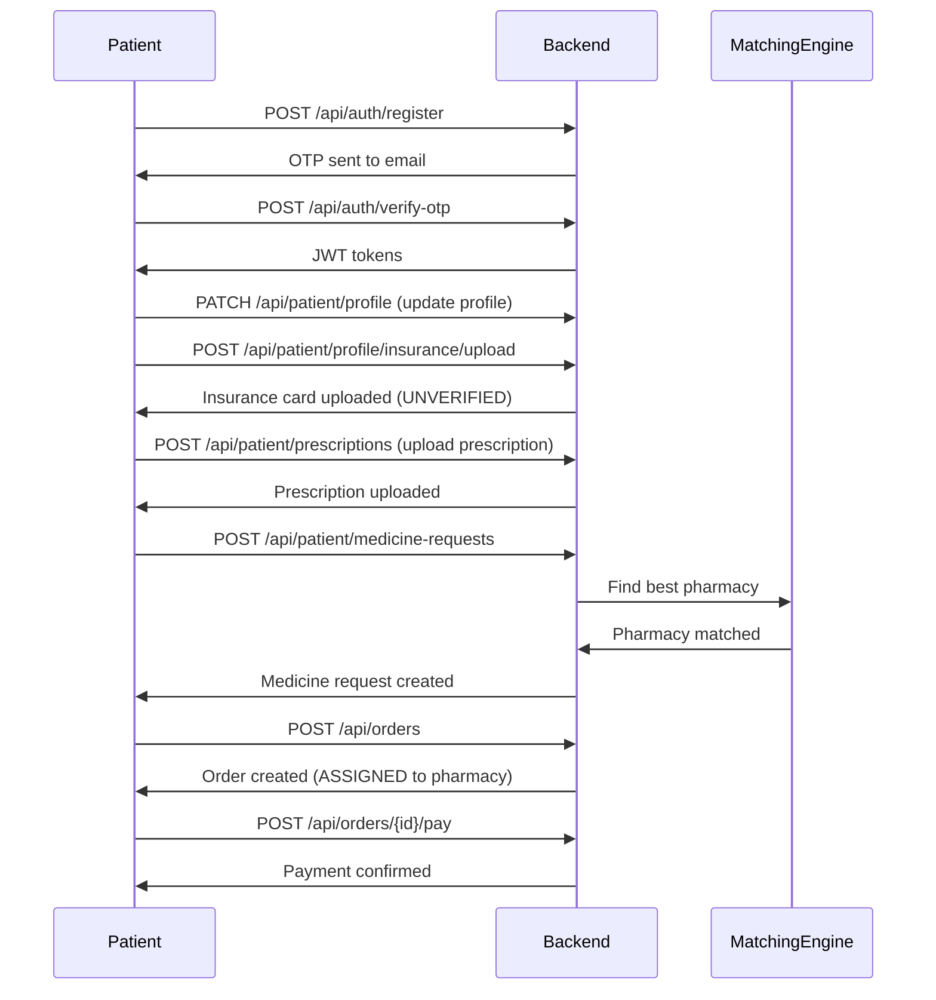
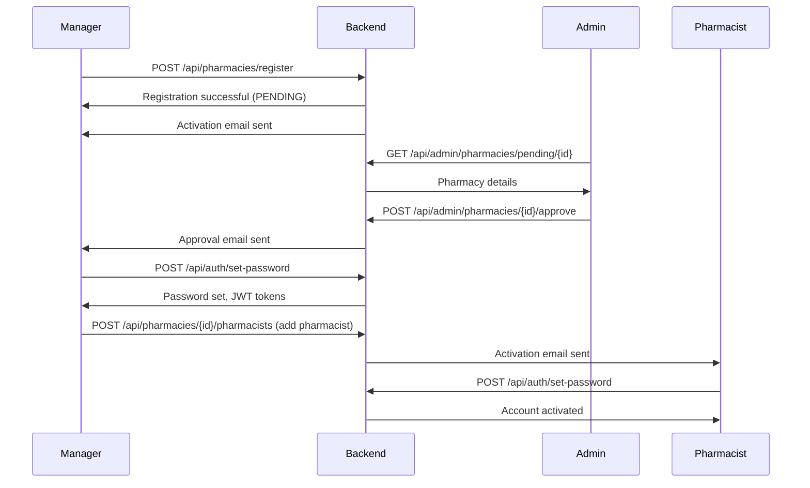
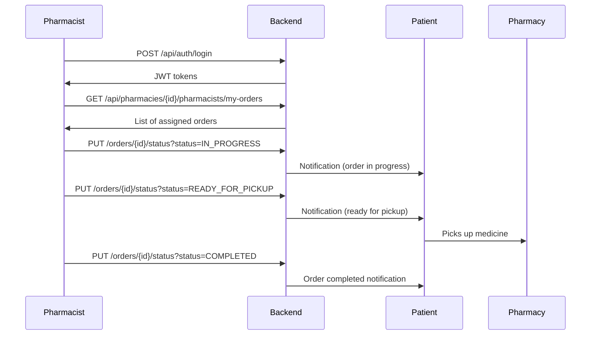
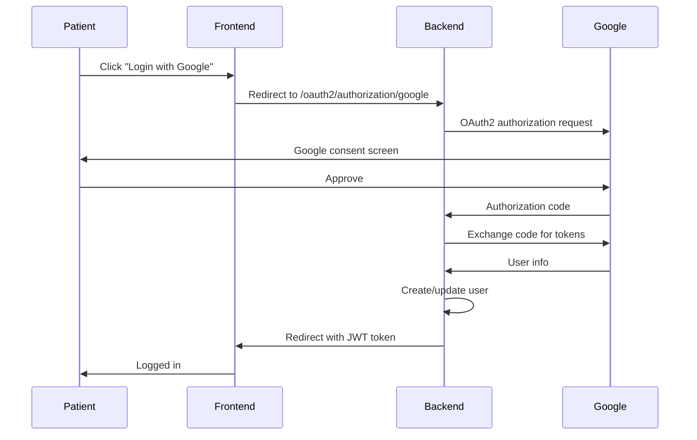
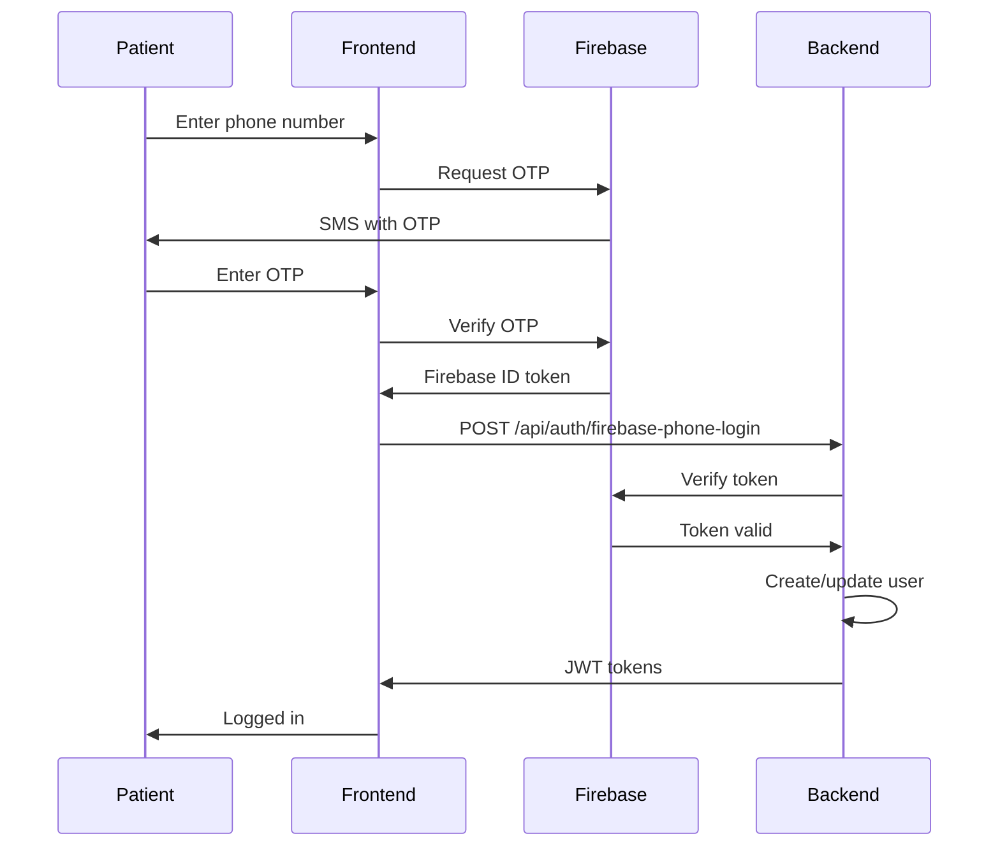
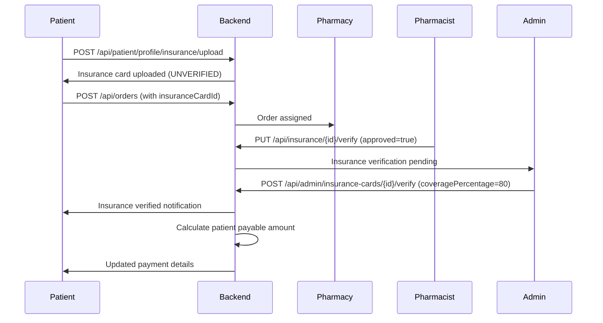

# MedDelivery API Documentation

## Table of Contents
1. [Authentication & Authorization](#authentication--authorization)
2. [API Endpoints by Module](#api-endpoints-by-module)
3. [User Flows](#user-flows)
4. [Error Handling](#error-handling)

---
## Accessing Swagger UI

**URL**: `http://localhost:8080/swagger-ui.html`  
**Production**: `https://med-delivery-system-be-production.up.railway.app/swagger-ui.html`


## Authentication & Authorization

### Authentication Methods

#### 1. JWT Token Authentication (Primary)
All authenticated requests require a JWT token in the Authorization header:
```
Authorization: Bearer <your_jwt_token>
```

#### 2. OAuth2 Google Login
- **Endpoint**: `/oauth2/authorization/google`
- **Flow**: Redirects to Google OAuth consent screen → Returns to `/login/oauth2/code/google` → Backend generates JWT
- **Configuration**: Set `GOOGLE_CLIENT_ID` and `GOOGLE_CLIENT_SECRET` in environment variables

#### 3. Firebase Phone Authentication
- **Endpoint**: `POST /api/auth/firebase-phone-login`
- **Flow**: Client verifies phone with Firebase → Sends Firebase token to backend → Backend validates and returns JWT
- **Configuration**: Set Firebase service account JSON in `FIREBASE_SERVICE_ACCOUNT_JSON` environment variable

### User Roles & Permissions

| Role | Description | Access Level |
|------|-------------|--------------|
| `ROLE_PATIENT` | End users requesting medicines | Patient endpoints |
| `ROLE_PHARMACIST` | Pharmacy staff dispensing medicines | Pharmacist endpoints |
| `ROLE_MANAGER` | Pharmacy managers | Manager + Pharmacist endpoints |
| `ROLE_SUPER_ADMIN` | Platform administrators | All endpoints |

---

## API Endpoints by Module

### 1. Authentication Module
**Base Path**: `/api/auth`

#### Register Patient
```http
POST /api/auth/register
Content-Type: application/json

{
  "username": "patient@example.com",
  "email": "patient@example.com",
  "phoneNumber": "+1234567890",
  "fullName": "John Doe"
}
```
**Response**: OTP sent to email/phone
**Flow**: Register → Verify OTP → Set Password (optional) → Login

#### Login (Email/Password)
```http
POST /api/auth/login
Content-Type: application/json

{
  "username": "manager@pharmacy.com",
  "password": "SecurePass123!"
}
```
**Response**: JWT tokens (access + refresh)
**Used By**: SUPER_ADMIN, MANAGER, PHARMACIST

#### Send OTP (Patient Login)
```http
POST /api/auth/send-otp?username=patient@example.com
```
**Response**: OTP sent to registered email/phone
**Used By**: PATIENT (passwordless login)

#### Verify OTP
```http
POST /api/auth/verify-otp
Content-Type: application/json

{
  "username": "patient@example.com",
  "otp": "123456"
}
```
**Response**: JWT tokens
**Used By**: PATIENT after registration or login

#### Firebase Phone Login
```http
POST /api/auth/firebase-phone-login?firebaseToken=<firebase_id_token>
```
**Response**: JWT tokens
**Used By**: PATIENT (phone number authentication)

#### Set Password
```http
POST /api/auth/set-password
Content-Type: application/json

{
  "token": "activation_token_from_email",
  "password": "NewSecurePass123!"
}
```
**Used By**: MANAGER, PHARMACIST (first-time activation)

#### Forgot Password
```http
POST /api/auth/forgot-password
Content-Type: application/json

{
  "email": "user@example.com"
}
```
**Response**: OTP sent to email

#### Reset Password
```http
POST /api/auth/reset-password
Content-Type: application/json

{
  "email": "user@example.com",
  "otp": "123456",
  "newPassword": "NewSecurePass123!"
}
```
**Response**: JWT tokens

#### Refresh Token
```http
POST /api/auth/refresh?refreshToken=<refresh_token>
```
**Response**: New JWT access token

#### Logout
```http
POST /api/auth/logout?refreshToken=<refresh_token>
```
**Response**: Success message

---

### 2. Patient Profile Module
**Base Path**: `/api/patient`
**Required Role**: `ROLE_PATIENT`

#### Get My Profile
```http
GET /api/patient/profile
Authorization: Bearer <jwt_token>
```

#### Update Profile
```http
PATCH /api/patient/profile
Authorization: Bearer <jwt_token>
Content-Type: application/json

{
  "fullName": "John Doe Updated",
  "dateOfBirth": "1990-01-15",
  "gender": "MALE",
  "bloodType": "O_POSITIVE",
  "allergies": "Penicillin",
  "chronicConditions": "Diabetes Type 2",
  "emergencyContactName": "Jane Doe",
  "emergencyContactPhone": "+1234567890",
  "emailNotifications": true,
  "smsNotifications": true
}
```

#### Upload Profile Image
```http
POST /api/patient/profile/image
Authorization: Bearer <jwt_token>
Content-Type: multipart/form-data

file: <image_file>
```

#### Add Insurance Card
```http
POST /api/patient/profile/insurance
Authorization: Bearer <jwt_token>
Content-Type: application/json

{
  "providerName": "Blue Cross Blue Shield",
  "memberId": "BCBS123456789",
  "frontImageUrl": "/api/files/insurance/front/abc123.jpg",
  "backImageUrl": "/api/files/insurance/back/def456.jpg"
}
```

#### Upload Insurance Card (with images)
```http
POST /api/patient/profile/insurance/upload
Authorization: Bearer <jwt_token>
Content-Type: multipart/form-data

frontImage: <front_image_file>
backImage: <back_image_file>
providerName: "Blue Cross Blue Shield"
memberId: "BCBS123456789"
```

#### Get My Insurance Cards
```http
GET /api/patient/profile/insurance
Authorization: Bearer <jwt_token>
```

#### Update Insurance Card
```http
PUT /api/patient/profile/insurance/{id}
Authorization: Bearer <jwt_token>
Content-Type: application/json

{
  "providerName": "Updated Provider",
  "memberId": "NEW123456"
}
```

#### Delete Insurance Card
```http
DELETE /api/patient/profile/insurance/{id}
Authorization: Bearer <jwt_token>
```

---

### 3. Prescription Module
**Base Path**: `/api/patient/prescriptions`
**Required Role**: `ROLE_PATIENT`

#### Upload Prescription
```http
POST /api/patient/prescriptions
Authorization: Bearer <jwt_token>
Content-Type: multipart/form-data

file: <prescription_file>
fileType: "PDF" or "JPG"
notes: "Optional notes"
prescriptionDate: "2024-01-15"
hasStamp: true
hasSignature: true
```

#### Get My Prescriptions
```http
GET /api/patient/prescriptions
Authorization: Bearer <jwt_token>
```

#### Get Prescription by ID
```http
GET /api/patient/prescriptions/{id}
Authorization: Bearer <jwt_token>
```

#### Delete Prescription
```http
DELETE /api/patient/prescriptions/{id}
Authorization: Bearer <jwt_token>
```

---

### 4. Medicine Request Module
**Base Path**: `/api/patient/medicine-requests`
**Required Role**: `ROLE_PATIENT`

#### Submit Medicine Request (Private - No Prescription)
```http
POST /api/patient/medicine-requests
Authorization: Bearer <jwt_token>
Content-Type: application/json

{
  "requestType": "PRIVATE",
  "medicines": [
    {
      "medicineName": "Aspirin",
      "dosage": "100mg",
      "quantity": 30
    }
  ],
  "notes": "Need urgently",
  "insuranceCardId": null
}
```

#### Submit Medicine Request (Prescription-Based)
```http
POST /api/patient/medicine-requests
Authorization: Bearer <jwt_token>
Content-Type: application/json

{
  "requestType": "PRESCRIPTION",
  "prescriptionId": 123,
  "insuranceCardId": 456,
  "notes": "Please verify with insurance"
}
```

#### Get My Requests
```http
GET /api/patient/medicine-requests
Authorization: Bearer <jwt_token>
```

#### Get Request by ID
```http
GET /api/patient/medicine-requests/{id}
Authorization: Bearer <jwt_token>
```

#### Confirm Request
```http
POST /api/patient/medicine-requests/{id}/confirm
Authorization: Bearer <jwt_token>
```

#### Cancel Request
```http
POST /api/patient/medicine-requests/{id}/cancel
Authorization: Bearer <jwt_token>
```

---

### 5. Order Module
**Base Path**: `/api/orders`
**Required Role**: `ROLE_PATIENT`

#### Create Order
```http
POST /api/orders
Authorization: Bearer <jwt_token>
Content-Type: application/json

{
  "medicineRequestId": 123,
  "fulfillmentType": "DELIVERY",
  "deliveryAddress": "123 Main St, City, State 12345",
  "insuranceCardId": 456
}
```

#### Get My Orders
```http
GET /api/orders/my-orders?page=0&size=10
Authorization: Bearer <jwt_token>
```

#### Get Order Details
```http
GET /api/orders/{id}
Authorization: Bearer <jwt_token>
```

#### Confirm Payment
```http
POST /api/orders/{id}/pay
Authorization: Bearer <jwt_token>
```

#### Get Payment Details
```http
GET /api/orders/{id}/payment
Authorization: Bearer <jwt_token>
```

---

### 6. Pharmacy Module
**Base Path**: `/api/pharmacies`

#### Register Pharmacy (Public)
```http
POST /api/pharmacies/register
Content-Type: application/json

{
  "name": "City Pharmacy",
  "licenseNumber": "PH123456",
  "address": "456 Pharmacy Ave",
  "city": "New York",
  "state": "NY",
  "zipCode": "10001",
  "phoneNumber": "+1234567890",
  "email": "contact@citypharmacy.com",
  "managerEmail": "manager@citypharmacy.com",
  "managerFullName": "Jane Manager",
  "managerPhoneNumber": "+1234567891"
}
```
**Response**: Pharmacy registered, pending admin approval

#### Get My Pharmacy
```http
GET /api/pharmacies/me
Authorization: Bearer <jwt_token>
```
**Required Role**: `ROLE_MANAGER`

#### Get Active Pharmacies
```http
GET /api/pharmacies/active
Authorization: Bearer <jwt_token>
```
**Required Role**: `ROLE_PATIENT` or `ROLE_PHARMACIST`

#### Transfer Manager
```http
POST /api/pharmacies/transfer-manager
Authorization: Bearer <jwt_token>
Content-Type: application/json

{
  "newManagerEmail": "newmanager@pharmacy.com",
  "newManagerFullName": "New Manager Name",
  "newManagerPhoneNumber": "+1234567892"
}
```
**Required Role**: `ROLE_MANAGER`

---

### 7. Pharmacist Module
**Base Path**: `/api/pharmacies/{pharmacyId}/pharmacists`

#### Add Pharmacist
```http
POST /api/pharmacies/{pharmacyId}/pharmacists
Authorization: Bearer <jwt_token>
Content-Type: application/json

{
  "email": "pharmacist@pharmacy.com",
  "fullName": "John Pharmacist",
  "phoneNumber": "+1234567893",
  "licenseNumber": "RPH123456"
}
```
**Required Role**: `ROLE_MANAGER`
**Response**: Pharmacist added, activation email sent

#### Get Pharmacists by Pharmacy
```http
GET /api/pharmacies/{pharmacyId}/pharmacists
Authorization: Bearer <jwt_token>
```
**Required Role**: `ROLE_MANAGER` or `ROLE_SUPER_ADMIN`

#### Get Pharmacist by ID
```http
GET /api/pharmacies/{pharmacyId}/pharmacists/{id}
Authorization: Bearer <jwt_token>
```
**Required Role**: `ROLE_MANAGER` or `ROLE_SUPER_ADMIN`

#### Get My Pharmacy Orders
```http
GET /api/pharmacies/{pharmacyId}/pharmacists/my-orders
Authorization: Bearer <jwt_token>
```
**Required Role**: `ROLE_PHARMACIST`

#### Update Order Status
```http
PUT /api/pharmacies/{pharmacyId}/pharmacists/orders/{orderId}/status?status=IN_PROGRESS
Authorization: Bearer <jwt_token>
```
**Required Role**: `ROLE_PHARMACIST`
**Valid Statuses**: `ASSIGNED`, `IN_PROGRESS`, `READY_FOR_PICKUP`, `COMPLETED`

#### Remove Pharmacist
```http
DELETE /api/pharmacies/{pharmacyId}/pharmacists/{id}
Authorization: Bearer <jwt_token>
```
**Required Role**: `ROLE_MANAGER`

---

### 8. Insurance Module
**Base Path**: `/api/insurance`

#### Verify Insurance (Pharmacy)
```http
PUT /api/insurance/{insuranceCardId}/verify?pharmacyId={pharmacyId}&approved=true&notes=Verified
Authorization: Bearer <jwt_token>
```
**Required Role**: `ROLE_PHARMACIST` or `ROLE_MANAGER`

#### Get Insurance Card
```http
GET /api/insurance/{insuranceCardId}
Authorization: Bearer <jwt_token>
```
**Required Role**: `ROLE_PATIENT`, `ROLE_PHARMACIST`, or `ROLE_MANAGER`

#### Mark as Pending Verification
```http
PUT /api/insurance/{insuranceCardId}/pending
Authorization: Bearer <jwt_token>
```
**Required Role**: `ROLE_PHARMACIST` or `ROLE_MANAGER`

---

### 9. Admin Module
**Base Path**: `/api/admin`
**Required Role**: `ROLE_SUPER_ADMIN`

#### Get Dashboard Stats
```http
GET /api/admin/dashboard/stats
Authorization: Bearer <jwt_token>
```

#### Search Users
```http
POST /api/admin/users/search
Authorization: Bearer <jwt_token>
Content-Type: application/json

{
  "role": "PATIENT",
  "status": "ACTIVE",
  "searchTerm": "john",
  "page": 0,
  "size": 20
}
```

#### Update User Status
```http
PUT /api/admin/users/{id}/status
Authorization: Bearer <jwt_token>
Content-Type: application/json

{
  "active": false,
  "reason": "Suspicious activity"
}
```

#### Get Pharmacy for Approval
```http
GET /api/admin/pharmacies/pending/{id}
Authorization: Bearer <jwt_token>
```

#### Approve/Reject Pharmacy
```http
POST /api/admin/pharmacies/{id}/approve
Authorization: Bearer <jwt_token>
Content-Type: application/json

{
  "approved": true,
  "notes": "All documents verified"
}
```

#### Suspend Pharmacy
```http
POST /api/admin/pharmacies/{id}/suspend?reason=License expired
Authorization: Bearer <jwt_token>
```

#### Replace Pharmacy Manager
```http
PUT /api/admin/pharmacies/{id}/manager
Authorization: Bearer <jwt_token>
Content-Type: application/json

{
  "newManagerEmail": "newmanager@pharmacy.com",
  "newManagerFullName": "New Manager",
  "newManagerPhoneNumber": "+1234567890"
}
```

#### Get Global Orders
```http
GET /api/admin/orders?page=0&size=20&status=COMPLETED
Authorization: Bearer <jwt_token>
```

#### Force Cancel Order
```http
POST /api/admin/orders/{id}/cancel
Authorization: Bearer <jwt_token>
Content-Type: application/json

{
  "reason": "Fraudulent order",
  "notes": "Reported by pharmacy"
}
```

#### Reassign Order
```http
POST /api/admin/orders/{id}/reassign
Authorization: Bearer <jwt_token>
Content-Type: application/json

{
  "newPharmacyId": 456,
  "reason": "Original pharmacy unavailable"
}
```

#### Get Low Stock Alerts
```http
GET /api/admin/inventory/low-stock?threshold=5
Authorization: Bearer <jwt_token>
```

#### Get Audit Logs
```http
GET /api/admin/audit-logs
Authorization: Bearer <jwt_token>
```

#### Generate Analytics Report
```http
GET /api/admin/reports/analytics?period=MONTHLY
Authorization: Bearer <jwt_token>
```

#### Verify Insurance Card (Admin)
```http
POST /api/admin/insurance-cards/{id}/verify?coveragePercentage=80.0
Authorization: Bearer <jwt_token>
```

#### Get Insurance Claims
```http
GET /api/admin/insurance-claims?page=0&size=10&status=PENDING
Authorization: Bearer <jwt_token>
```

#### Process Insurance Claim
```http
POST /api/admin/insurance-claims/{id}/process?action=APPROVE
Authorization: Bearer <jwt_token>
```

---

## User Flows

### Flow 1: Patient Registration & First Order



### Flow 2: Pharmacy Registration & Approval



### Flow 3: Order Processing by Pharmacist



### Flow 4: OAuth2 Google Login (Patient)



### Flow 5: Firebase Phone Authentication (Patient)



### Flow 6: Insurance Verification



---

## Error Handling

### Standard Error Response Format
```json
{
  "success": false,
  "message": "Error description",
  "data": null,
  "timestamp": "2024-01-15T10:30:00Z"
}
```

### Common HTTP Status Codes

| Code | Meaning | Example |
|------|---------|---------|
| 200 | Success | Request processed successfully |
| 201 | Created | Resource created (e.g., order, prescription) |
| 400 | Bad Request | Invalid input data |
| 401 | Unauthorized | Missing or invalid JWT token |
| 403 | Forbidden | Insufficient permissions |
| 404 | Not Found | Resource doesn't exist |
| 409 | Conflict | Duplicate resource (e.g., email already exists) |
| 429 | Too Many Requests | Rate limit exceeded (OTP requests) |
| 500 | Server Error | Internal server error |

### Common Error Scenarios

#### Authentication Errors
```json
{
  "success": false,
  "message": "Invalid credentials",
  "data": null
}
```

#### Validation Errors
```json
{
  "success": false,
  "message": "Validation failed",
  "data": {
    "email": "Invalid email format",
    "phoneNumber": "Phone number is required"
  }
}
```

#### Authorization Errors
```json
{
  "success": false,
  "message": "Access denied. Required role: ROLE_MANAGER",
  "data": null
}
```

#### Rate Limit Errors
```json
{
  "success": false,
  "message": "Too many OTP requests. Please try again in 15 minutes.",
  "data": null
}
```

---

## Rate Limiting

### OTP Endpoints
- **Send OTP**: 3 requests per 15 minutes per user
- **Verify OTP**: 5 attempts per 15 minutes per user

### Configuration
Set in `application.properties`:
```properties
rate.limit.otp.send.max=3
rate.limit.otp.send.window.minutes=15
rate.limit.otp.verify.max=5
rate.limit.otp.verify.window.minutes=15
```

---

## WebSocket Support

### Real-time Order Updates
- **Endpoint**: `ws://your-domain/ws`
- **Topics**: 
  - `/topic/orders/{orderId}` - Order status updates
  - `/topic/user/{userId}` - User-specific notifications

### Configuration
Set allowed origins in `application.properties`:
```properties
websocket.allowed.origins=http://localhost:3000,https://your-frontend.com
```

---

## File Upload

### Supported File Types
- **Prescriptions**: PDF, JPG, JPEG, PNG (max 10MB)
- **Insurance Cards**: JPG, JPEG, PNG (max 10MB)
- **Profile Images**: JPG, JPEG, PNG (max 10MB)

### File Storage
Files are stored in `./uploads` directory with subdirectories:
- `prescriptions/`
- `insurance/front/`
- `insurance/back/`
- `profile/`

### Accessing Files
```http
GET /api/files/{path}
```
Example: `GET /api/files/prescriptions/abc123.pdf`

---

## Environment Variables

### Required Variables
```bash
# Database
PGHOST=localhost
PGPORT=5432
PGDATABASE=meddelivery
PGUSER=postgres
PGPASSWORD=your_password

# Redis
REDISHOST=localhost
REDISPORT=6379

# JWT
JWT_SECRET=your_secret_key_min_256_bits

# Email
MAIL_USERNAME=your_email@gmail.com
MAIL_PASSWORD=your_app_password

# OAuth2
GOOGLE_CLIENT_ID=your_google_client_id
GOOGLE_CLIENT_SECRET=your_google_client_secret
OAUTH2_REDIRECT_URI=http://localhost:8080/login/oauth2/code/google

# Firebase
FIREBASE_SERVICE_ACCOUNT_JSON={"type":"service_account",...}

# CORS
CORS_ALLOWED_ORIGINS=http://localhost:3000,http://localhost:4200

# WebSocket
WEBSOCKET_ALLOWED_ORIGINS=http://localhost:3000,http://localhost:4200
```

---

## API Versioning

Current version: **v1** (implicit in base path `/api`)

Future versions will use explicit versioning:
- `/api/v2/...`

---

## Support & Contact

For API support, contact: samillah.mutoni@gmail.com

**Documentation Version**: 1.0.0  
**Last Updated**: 2024-01-15
